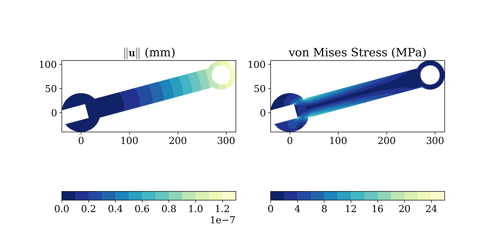

# Introduction to the Finite Element Method

## Introduction

This repository contains teaching resources for an introductory course on Finite Element Analysis. The course in its present form is intended for last year undergraduate students enrolled in the **Mechanical Engineering** and **Civil Engineering** programs at Universidad EAFIT and for first-semester graduate students enrolled in the **M.Sc.** and **Ph.D.** programs in the Applied Mechanics track. The course emphasizes on the solution, through finite element algorithms, of the theory of elasticity boundary value problem. It combines theoretical aspects and computational implementations in Python. The material for this introductory course has been typically covered in an 18-weeks semester with 2 hours long weekly meetings. The course is divided into three parts. It starts by covering standard numerical methods such as interpolation theory and numerical quadratures which are numerical tools required in the formulation of finite element algorithms. The course continues with a review of the problem of the theory of elasticity, and particularly its formulation in the form of a boundary value problem stated in terms of the Principle of Virtual Work. The third and final part uses the covered numerical techniques to generate a finite element representation of the virtual work principle

## Flipped class approach

The course has been designed to be imparted in a [flipped classroom environment](https://en.wikipedia.org/wiki/Flipped_classroom) where most of the theoretical contents are covered by the student through independent study complemented with brief homework assignments. On the other hand, the 2-hour class sessions are dedicated to the solution of hands-on computational and theoretical problems under the instructor guidance. For the development of the methodological approach of inverted class the following resources are available in this repository:

* **Lecture notes:** A collection of the theoretical material covered in several textbooks combined with independent developments by the Applied Mechanics Group and organized to facilitate independent study.

* **Notebooks:** A series of Jupyter Notebooks summarizing the theoretical discussion (treated in more detail in the lecture notes) combined with computer implementations in Python. The notebooks contain brief activities intended for self-learning and several, more demanding in-class activities to be developed under the instructor's guidance.

* **SolidsPy:** A Python-based finite element code for the stress analysis of arbitrary two-dimensional domains. The code, which has been developed as part of this course by the Applied Mechanics Group, is structured to be used as a stand-alone application or through the combination of independent modules. The modules used in the different notebooks follow the same structure of those in the code. The code is available in the [Applied Mechanics' repository](https://github.com/AppliedMechanics-EAFIT/SolidsPy).

## Contents

The course contents are those described by the following set of notebooks. **NB-0** covers the basics of Notebooks and provides examples of basic programming skills in Python. **NB-1** through **NB-5** presents standard interpolation and numerical integration techniques but within the context of the finite element method. In particular, **NB-4** applies an initial definition of a finite element to a problem of visualization of functions over two-dimensional domains. The formulation of the finite element method to the elasticity problem is defined in **NB-8** and following.

[NB-0a: Introductory Notebook](<https://bit.ly/33otk8l>)

[NB-0b: A simple finite element code](<https://bit.ly/2B4AouG>)

[NB-1: One-dimensional Lagrange interpolation-Principles](<https://bit.ly/325LdbX>)

[NB-2: One-dimensional Lagrange interpolation-Nonlocal scheme](<https://bit.ly/2M7QOJh>)

[NB-3: Two-dimensional Lagrange interpolation](<https://bit.ly/2B8wZep>)

[NB-4: Application. Visualization of a solution in a complete domain](<https://bit.ly/3293AN3>)

[NB-5: Numerical integration in the Finite Element Method](<https://bit.ly/2IIaYay>)

[NB-6: Computation of the stiffness matrix](<https://bit.ly/33n3K3J>)

[NB-7: The linearized theory of elasticity](<https://bit.ly/2VA6TdX>)

[NB-8: Finite element formulation of the elasticity BVP](<https://bit.ly/2MDE3oD>)

[NB-9: Assembly of the FEM equlibrium equations](<https://bit.ly/2IISI0E>)

[NB-10: Solution and post-processing](<https://bit.ly/2nBwnea>)

[NB-11: Convergency of the analysis results](<https://bit.ly/35sgO9R>)

[NB-12: Finite element analysis with SolidsPy](<https://bit.ly/31eKHr3>)

[NB-13: Truss elements](<https://bit.ly/329Rpjj>)

[NB-14: Frame elements](<https://bit.ly/35sybHE>)
